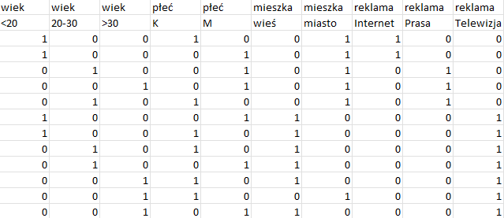
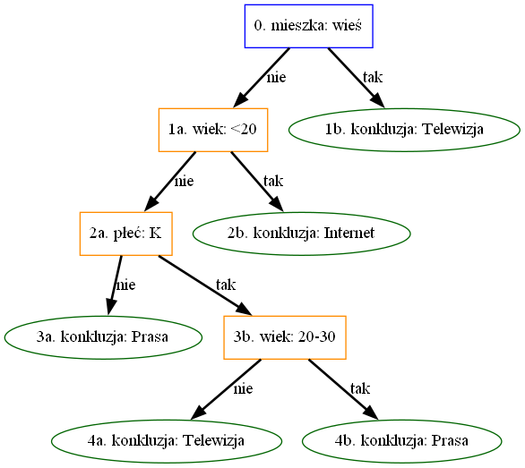
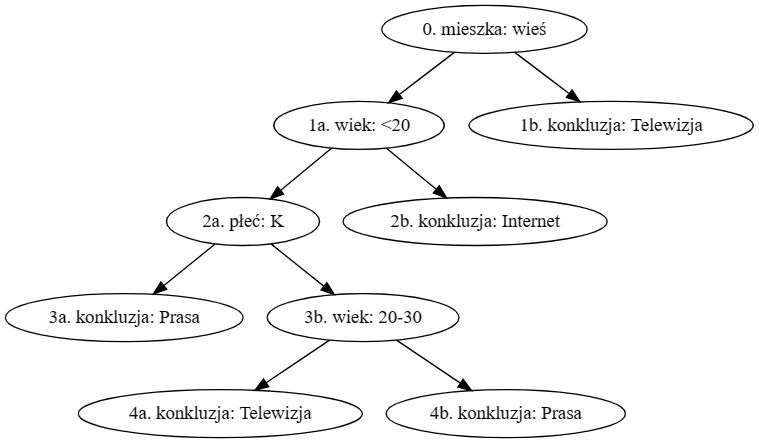

# Implementacja algorytmu ID3

Generacja binarnego drzewa decyzyjnego na podstawie zbioru danych


## Przygotowanie danych
Dane należy przygotować w postaci pliku `.csv`. Zbiór danych musi być w postaci długiej z dwoma poziomami nagłówków. Pierwszy poziom powinien składać się z nazwy warunku a następny z wartości poszczególnych warunków. Konkluzje powinny być ostatnimi kolumnami tabeli.

### Przykład struktury danych


    
## Wymagane biblioteki

```
numpy
pandas
anytree
tkinter
```


## Uruchomienie

Po uruchomieniu skryptu `ID3.py` należy wybrać gdzie znajduje się plik z danymi. W wyniku działania skryptu zostanie wygenerowany plik `tree.dot` który reprezentuje połączenia między elementami binarnego drzewa decyzyjnego oraz plik `ID3.png` jeżeli wykryte zostało oprogramowanie GraphViz. Zawartość pliku `.dot` dla danych z przykładu będzie wyglądać następująco:
```
digraph tree {
    "0. mieszka: wieś";
    "1a. wiek: <20";
    "2a. płeć: K";
    "3a. konkluzja: Prasa";
    "3b. wiek: 20-30";
    "4a. konkluzja: Telewizja";
    "4b. konkluzja: Prasa";
    "2b. konkluzja: Internet";
    "1b. konkluzja: Telewizja";
    "0. mieszka: wieś" -> "1a. wiek: <20";
    "0. mieszka: wieś" -> "1b. konkluzja: Telewizja";
    "1a. wiek: <20" -> "2a. płeć: K";
    "1a. wiek: <20" -> "2b. konkluzja: Internet";
    "2a. płeć: K" -> "3a. konkluzja: Prasa";
    "2a. płeć: K" -> "3b. wiek: 20-30";
    "3b. wiek: 20-30" -> "4a. konkluzja: Telewizja";
    "3b. wiek: 20-30" -> "4b. konkluzja: Prasa";
}
```


## Wizualizacja

Binarne drzewo decyzyjne zostanie wyeksportowane do `ID3.png` jeżeli został zainstalowany [GraphViz](https://graphviz.org/). Zachowane zostaną wówczas wszystkie atrybuty elementów grafu, takie jak kolor, kształt i opis strzałek. 



Drzewko wygenerowane w `.dot` można również zwizualizować bez instalowania dodatkowego oprogramowania przy pomocy wersji online: [GraphVizOnline](https://dreampuf.github.io/GraphvizOnline/)


